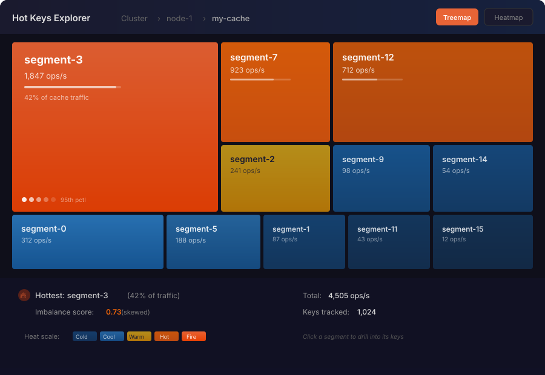
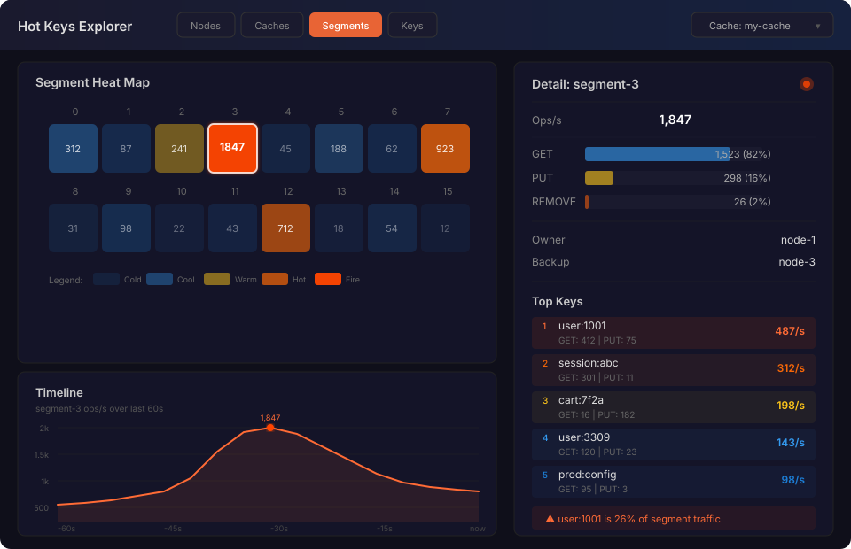

# Hot Keys Tracking and Visualization

Issue: [#17746 — Track hot keys per cache](https://github.com/infinispan/infinispan/issues/17746)

## Overview

Introduce a mechanism to track hot keys per cache using the `HeavyKeeper` data structure.
The implementation must be very lightweight since it sits on the hot-path of every cache operation.

Tracking is split by operation type (reads vs writes) so that consumers can analyze them
independently or combine them as needed.

## Data hierarchy

Hot key data naturally forms a hierarchy that users can navigate top-down to identify
and resolve hotspots:

```
Cluster
  └─ Nodes        — which nodes are overloaded?
       └─ Caches   — which caches drive the load?
            └─ Segments — which segments are skewed?
                 └─ Keys  — which individual keys are hot?
```

At every level, an **imbalance score** (0 = perfectly uniform, 1 = all traffic on one entity)
tells users at a glance whether the distribution is healthy or pathologically skewed.

## Console visualization

Three complementary views are proposed, each optimized for a different question.
They can coexist as switchable views in the Infinispan console.

### View 1 — Treemap drill-down



**Best for:** quickly spotting disproportionate hotness.

- Rectangle **area** encodes traffic volume; **color** encodes heat intensity
  (cold blue → fire orange).
- Click any rectangle to drill into its children (segments → keys).
- Breadcrumb navigation at the top shows the current path in the hierarchy.
- Bottom bar shows the hottest entity, imbalance score, total throughput,
  and number of tracked keys.

When drilling into a segment, the treemap shows individual keys with their
ops/s and GET/PUT breakdown.

### View 2 — Heat map grid with detail panel



**Best for:** comparing all segments (or nodes/caches/keys) side by side.

- Left panel: uniform grid of cells colored by heat intensity. The selected
  cell gets a white border highlight.
- Right panel: detail for the selected cell — operation breakdown (GET/PUT/REMOVE
  as horizontal bars), segment ownership info, and a ranked list of top keys.
- Bottom left: a sparkline timeline (last 60 seconds) showing how the selected
  entity's traffic evolved.
- Top tabs (`Nodes | Caches | Segments | Keys`) let the user switch the grid
  to any level of the hierarchy.

### View 3 — Cluster topology



**Best for:** answering "which nodes are overloaded?" at a glance.

- Nodes are rendered as cards with a colored border and radial glow proportional
  to their heat. The hottest node pulses.
- Dashed lines between nodes represent the cluster topology.
- Below the nodes: horizontal bars show cache-level traffic distribution,
  with the bar fill colored by heat.
- Bottom: an alerts section with tiered severity (critical / warning / suggestion)
  surfacing actionable insights, e.g.:
  - "node-1 handles 74% of cluster traffic (expected ~33%)"
  - "my-cache:segment-3 is a single-key hotspot"
  - "Consider: key affinity rebalance, near-cache, or read-behind"

## Recommended navigation flow

| Landing view | Question it answers | Drill-down target |
|---|---|---|
| **Topology** (View 3) | Which nodes are overloaded? | Click a node → View 2 (caches) |
| **Heatmap** (View 2) | Which segments/caches are skewed? | Click a cell → View 1 (treemap) |
| **Treemap** (View 1) | Which keys dominate a segment? | Leaf level: key detail |

The topology view serves as the natural landing page. From there, users drill into
progressively finer granularity until they identify the specific keys causing the hotspot.

## Data structure layering

HeavyKeeper is a probabilistic data structure for top-k heavy hitter detection. It only
needs to exist at the cache level — one instance for reads, one for writes. Everything
above in the hierarchy is derived from lightweight counters or computed at query time.

| Level | Data source | Cost |
|---|---|---|
| Keys | HeavyKeeper top-k extraction | The only probabilistic structure |
| Segments | Derived from keys via `KeyPartitioner.getSegment(key)` | Zero — groupBy on query |
| Caches | Atomic ops counters (read + write) | Two `LongAdder`s per cache |
| Nodes | Sum of cache counters on that node | Aggregation at query time |
| Cluster | Sum of node counters | Aggregation at query time |

### Why not HeavyKeeper at every level?

HeavyKeeper instances are not directly comparable or mergeable (unlike Count-Min Sketch).
Their internal fingerprint-based buckets with exponential decay don't compose. But we don't
need them to: the questions at higher levels ("which cache is hottest?", "which node is
overloaded?") are answered by simple throughput counters, not top-k analysis.

### Segment heat derivation

Every key maps to a deterministic segment via the `KeyPartitioner`. When the top-k is
extracted from the HeavyKeeper, grouping by `keyPartitioner.getSegment(key)` yields
per-segment heat for free. No additional data structure is needed.

### Imbalance score

Computed at query time from the counters at the level below:

- **Cache imbalance**: standard deviation of segment ops / mean, normalized to 0..1
- **Node imbalance**: standard deviation of cache ops / mean
- **Cluster imbalance**: standard deviation of node ops / mean

A score of 0 means perfectly uniform distribution. A score approaching 1 means all
traffic concentrates on a single entity.

## Configuration

Currently, statistics is a simple `statistics="true|false"` attribute on the cache element,
backed by `StatisticsConfiguration` with a single `ENABLED` boolean. To accommodate hot keys
tracking, we promote this to a proper sub-element.

### Declarative (XML)

The existing `statistics` attribute on `<*-cache>` is preserved for backward compatibility.
A new `<statistics>` child element is introduced:

```xml
<distributed-cache name="my-cache">
  <statistics enabled="true">
    <hot-keys enabled="true"
              top-k="100"
              window="60s"
              initial-capacity="256"
              reads="true"
              writes="true"/>
  </statistics>
  <!-- ... -->
</distributed-cache>
```

When only the attribute form is used (`<distributed-cache statistics="true">`), hot keys
tracking defaults to disabled to preserve existing behavior and performance characteristics.

| Attribute | Default | Description |
|---|---|---|
| `enabled` | `false` | Enable hot keys tracking for this cache |
| `top-k` | `100` | Number of top keys to track per operation type |
| `window` | `60s` | Sliding time window for frequency counting |
| `initial-capacity` | `256` | Initial capacity of the HeavyKeeper sketch |
| `reads` | `true` | Track hot reads separately |
| `writes` | `true` | Track hot writes separately |

### Programmatic

Configuration is done via `StatisticsConfigurationBuilder`, which gains a new
`hotKeys()` sub-builder:

```java
ConfigurationBuilder builder = new ConfigurationBuilder();
builder.statistics()
   .enable()
   .hotKeys()
      .enable()
      .topK(100)
      .window(60, TimeUnit.SECONDS)
      .reads(true)
      .writes(true);
```

### Schema changes

The XSD gains a new `statistics` complex type under cache:

```xml
<xs:complexType name="statistics">
  <xs:sequence>
    <xs:element name="hot-keys" type="hot-keys-type" minOccurs="0"/>
  </xs:sequence>
  <xs:attribute name="enabled" type="xs:boolean" default="false"/>
</xs:complexType>

<xs:complexType name="hot-keys-type">
  <xs:attribute name="enabled" type="xs:boolean" default="false"/>
  <xs:attribute name="top-k" type="xs:positiveInteger" default="100"/>
  <xs:attribute name="window" type="xs:string" default="60s"/>
  <xs:attribute name="initial-capacity" type="xs:positiveInteger" default="256"/>
  <xs:attribute name="reads" type="xs:boolean" default="true"/>
  <xs:attribute name="writes" type="xs:boolean" default="true"/>
</xs:complexType>
```

The parser must handle both the legacy attribute form and the new element form.
When both are present, the element takes precedence.

### Implementation classes

| Class | Change |
|---|---|
| `StatisticsConfiguration` | Add `HotKeysConfiguration` child element |
| `StatisticsConfigurationBuilder` | Add `hotKeys()` returning `HotKeysConfigurationBuilder` |
| `HotKeysConfiguration` | New — holds top-k, window, reads/writes flags |
| `HotKeysConfigurationBuilder` | New — builder for the above |
| `CacheParser` | Handle new `<statistics>` element and `<hot-keys>` sub-element |
| `CacheSerializer` | Serialize the new elements |

## REST API

Hot keys data is exposed via the REST v3 API, following the existing conventions:
underscore-prefixed action paths, JSON responses, OpenAPI metadata, and async handlers
via `CompletableFuture.supplyAsync()`.

### Container-level endpoints

Implemented in `ContainerResourceV3`.

#### `GET /v3/container/_hotkeys`

Returns a cluster-wide overview: per-node ops/s, per-cache ops/s, and imbalance
scores. This is the data behind the topology view (View 3).

```json
{
  "cluster": {
    "total_ops": 4397,
    "read_ops": 3621,
    "write_ops": 776,
    "imbalance_score": 0.73
  },
  "nodes": [
    {
      "name": "node-1",
      "total_ops": 3271,
      "read_ops": 2690,
      "write_ops": 581,
      "caches": {
        "my-cache": { "total_ops": 3430, "read_ops": 2845, "write_ops": 585 },
        "sessions": { "total_ops": 660, "read_ops": 520, "write_ops": 140 }
      }
    }
  ]
}
```

| Parameter | Type | Default | Description |
|---|---|---|---|
| `scope` | query | `cluster` | `cluster` or `local` (single node) |

### Cache-level endpoints

Implemented in `CacheResourceV3`.

#### `GET /v3/caches/{cacheName}/_hotkeys`

Returns the hot keys for a specific cache: segment heat and top-k keys. This is the
data behind the heatmap (View 2) and treemap (View 1) views.

```json
{
  "cache": "my-cache",
  "total_ops": 4505,
  "read_ops": 3712,
  "write_ops": 793,
  "imbalance_score": 0.73,
  "segments": [
    {
      "segment": 3,
      "total_ops": 1847,
      "read_ops": 1523,
      "write_ops": 324,
      "owner": "node-1",
      "top_keys": {
        "reads": [
          { "key": "user:1001", "ops": 412 },
          { "key": "session:abc", "ops": 301 }
        ],
        "writes": [
          { "key": "cart:7f2a", "ops": 182 },
          { "key": "user:1001", "ops": 75 }
        ]
      }
    }
  ]
}
```

| Parameter | Type | Default | Description |
|---|---|---|---|
| `type` | query | `all` | `reads`, `writes`, or `all` |
| `top-k` | query | configured value | Override the number of top keys returned |
| `scope` | query | `local` | `local` or `cluster` (aggregated across nodes) |

#### `POST /v3/caches/{cacheName}/_hotkeys-reset`

Resets the HeavyKeeper state and counters for the cache. Requires `ADMIN` permission.

| Response | Condition |
|---|---|
| `204 No Content` | Reset successful |
| `404 Not Found` | Cache not found or hot keys not enabled |

### Implementation

| Class | Change |
|---|---|
| `ContainerResourceV3` | Add `_hotkeys` GET handler |
| `CacheResourceV3` | Add `_hotkeys` GET and `_hotkeys-reset` POST handlers |
| `HotKeysStats` | New — aggregates HeavyKeeper top-k + counters into JSON via `toJson()` |

The handlers follow the same pattern as the existing `_stats` endpoints: retrieve the
cache/container, obtain the stats object, serialize to JSON, and return via
`asJsonResponseFuture()`.

## Metrics exposed

Each level of the hierarchy should expose:

| Metric | Description |
|---|---|
| `ops/s` | Total operations per second |
| `read_ops/s` | Read operations per second |
| `write_ops/s` | Write operations per second |
| `read_write_ratio` | Ratio of reads to writes |
| `imbalance_score` | 0..1 skew indicator across children |
| `top_k` | Ranked list of hottest children |

## Console component requirements

The console uses PatternFly 6 and React 18. Charts use `@patternfly/react-charts` v8
(which wraps Victory). The existing `DataDistributionChart` and `ClusterDistributionChart`
already use `Chart`, `ChartBar`, `ChartStack`, `ChartGroup`, and `ChartVoronoiContainer`.

### What's covered by existing dependencies

| Component needed | Library | Notes |
|---|---|---|
| Cache distribution bars (View 3) | `@patternfly/react-charts` | Same pattern as existing `ClusterDistributionChart` |
| GET/PUT/REMOVE stacked bars (View 2) | `@patternfly/react-charts` | `ChartStack` + `ChartBar`, already in use |
| Timeline sparkline (View 2) | `@patternfly/react-charts` | `ChartArea` or `ChartLine`, available but not yet used |
| Detail panel, tabs, cards, tables | `@patternfly/react-core` | Standard PF components, already installed |

### New dependencies needed

| Component | Recommendation | Size |
|---|---|---|
| **Treemap** (View 1) | Add `d3-hierarchy` for the treemap layout algorithm. Render as SVG `<rect>` elements in a custom React component. Victory and PatternFly charts do not offer a treemap. | ~15 KB |
| **Heat map grid** (View 2) | No library needed. CSS grid of PatternFly `Card` components with dynamic background colors. | — |
| **Topology diagram** (View 3) | Two options: (a) add `@patternfly/react-topology` for the PatternFly-native node graph with built-in layouts, or (b) custom SVG since the node count is small (typically 3–10). Option (a) is preferred for consistency with PatternFly. | ~80 KB |

### Summary of package changes

```
npm install d3-hierarchy @patternfly/react-topology
npm install -D @types/d3-hierarchy
```

No changes needed to Victory or `@patternfly/react-charts` — they stay at their
current versions.

## CLI

The CLI exposes hot keys data as tabular output, with optional JSON and CSV formats
for scripting and integration with external monitoring tools.

### Commands

#### `cache hotkeys <cache-name>`

Displays the top-k hot keys for a cache.

```
[node-1]> cache hotkeys my-cache
Key            | Reads | Writes | Total
---------------+-------+--------+------
user:1001      |   412 |     75 |   487
session:abc    |   301 |     11 |   312
cart:7f2a      |    16 |    182 |   198
user:3309      |   120 |     23 |   143
prod:config    |    95 |      3 |    98
```

| Option | Description |
|---|---|
| `--type=reads\|writes\|all` | Filter by operation type (default: `all`) |
| `--top-k=N` | Override the number of keys shown |
| `--format=table\|json\|csv` | Output format (default: `table`) |

JSON output:

```
[node-1]> cache hotkeys my-cache --format=json
[
  { "key": "user:1001", "reads": 412, "writes": 75, "total": 487 },
  { "key": "session:abc", "reads": 301, "writes": 11, "total": 312 }
]
```

CSV output:

```
[node-1]> cache hotkeys my-cache --format=csv
key,reads,writes,total
user:1001,412,75,487
session:abc,301,11,312
```

#### `cache hotkeys-segments <cache-name>`

Displays per-segment heat for a cache.

```
[node-1]> cache hotkeys-segments my-cache
Segment | Owner  | Reads | Writes | Total
--------+--------+-------+--------+------
      3 | node-1 | 1,523 |    324 | 1,847
      7 | node-2 |   756 |    167 |   923
     12 | node-1 |   583 |    129 |   712
      0 | node-1 |   256 |     56 |   312
      2 | node-3 |   198 |     43 |   241
     ...
```

Supports the same `--format` and `--type` options.

#### `container hotkeys`

Displays cluster-wide cache heat summary.

```
[node-1]> container hotkeys
Cache        | Reads | Writes | Total
-------------+-------+--------+------
my-cache     | 3,712 |    793 | 4,505
sessions     |   520 |    140 |   660
auth-tokens  |   176 |     44 |   220
config       |    72 |     16 |    88
```

Supports the same `--format` option.

## Color scale

A consistent five-level heat scale is used across all views:

| Level | Color | Meaning |
|---|---|---|
| Cold | Dark blue | Well below average traffic |
| Cool | Medium blue | Below average traffic |
| Warm | Yellow | Average traffic |
| Hot | Orange | Above average traffic |
| Fire | Red-orange | Significantly above average |

Thresholds are relative to the mean across siblings at the same hierarchy level,
so the scale adapts whether you're looking at 3 nodes or 256 segments.
